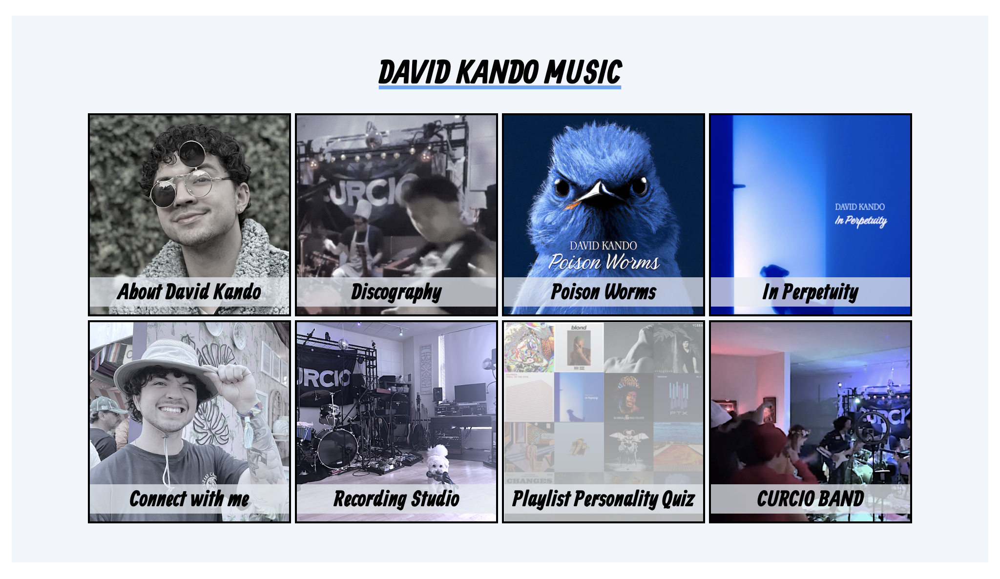
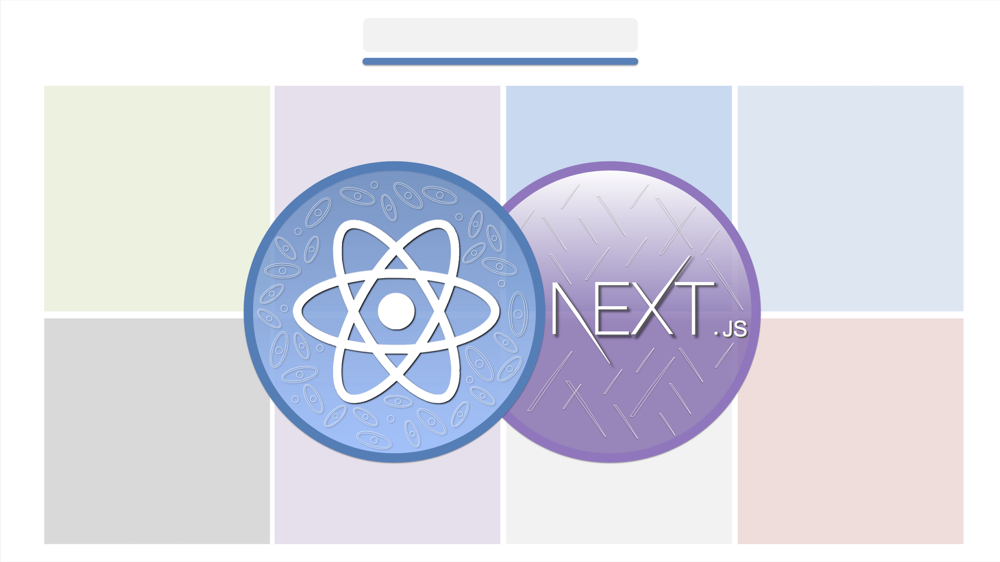

# [davidkandomusic.com](https://www.davidkandomusic.com)

This site is made with Next.js and React 18.
Explore the site to listen to my music, under the artist name, David Kando. There's also easter eggs!

### Udemy Course: Next.js and React 18 | Build a Production Site
**[https://www.udemy.com/course/nextjs-and-react-bootcamp](https://www.udemy.com/course/nextjs-and-react-bootcamp/?referralCode=686A52209BC6FC20C7B7)**

Learn how I built davidkandomusic.com using Next.js and React 18. In this course, you will learn:

* The Next.js React Framework and React 18
* Client vs. Server Components and Client-Side vs. Server-Side Rendering
* New React 18 hooks: useTransition and useDeferredValue
* React Suspense
* The Next.js Architecture: Layouts, Pages, and Routes
* Next.js Dynamic Segments and Route Groups
* Next.js hooks like usePathname and useSelectedLayoutSegments
* Next.js Deployment with Vercel
* Tailwind CSS
* And more

